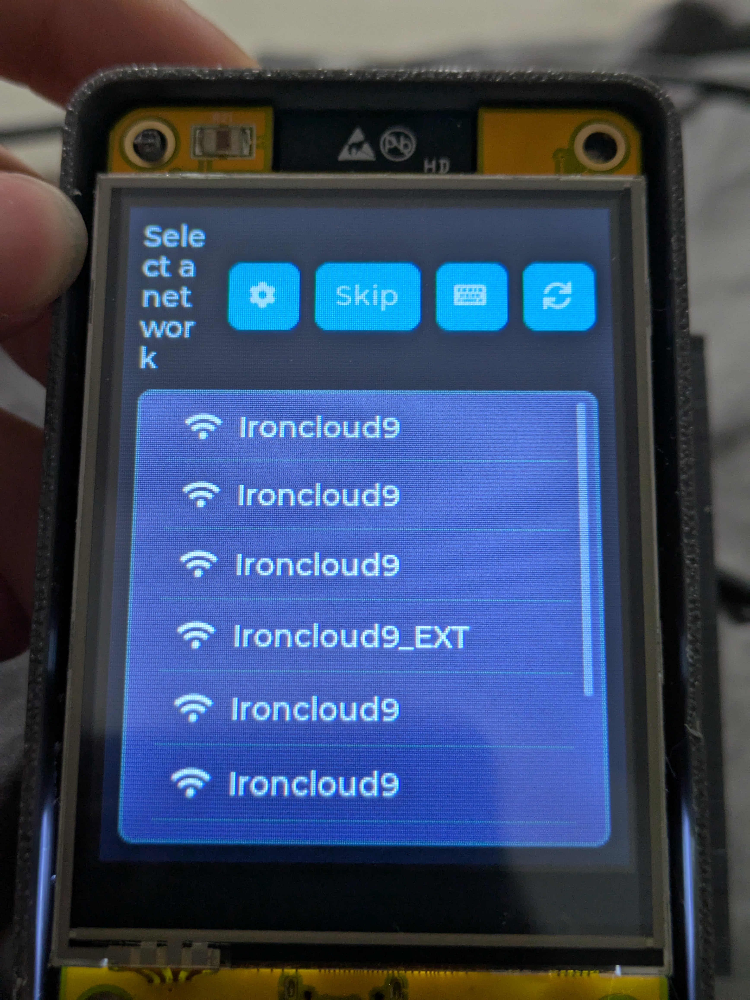
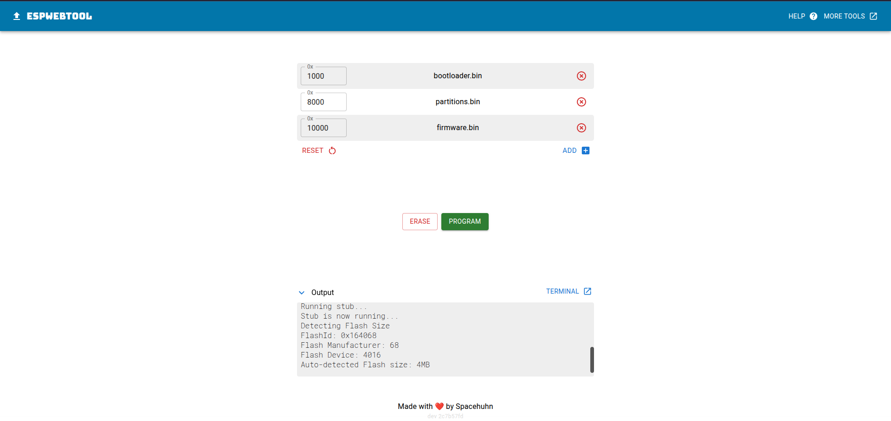
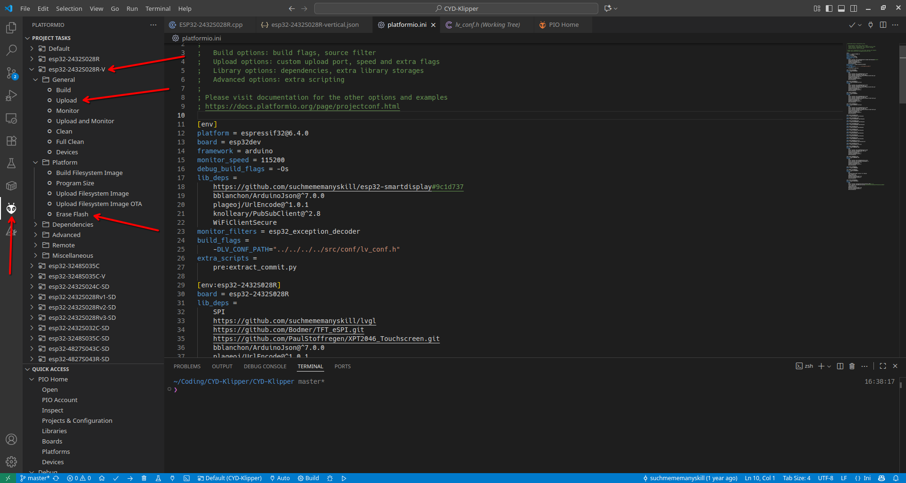

# CYD-Klipper (Vertical Layout Fork)

> **Note:** This is a fork of the original [CYD-Klipper by suchmememanyskill](https://github.com/suchmememanyskill/CYD-Klipper) which adds **Vertical Screen Support** for the `esp32-2432S028R` (2.8" CYD).

An implementation of a wireless Klipper, Bambu Lab, and OctoPrint status display on an ESP32 device. It uses the Moonraker API to fetch data from Klipper.

This project offers a simple and cheap solution for a dedicated screen with Klipper, and also provides support for Bambu Lab and OctoPrint printers.

### Required Hardware

An `ESP32-2432S028R` or a compatible device is required to run this project. For a list of compatible screens and where to buy them, please refer to the ["ESP32 Cheap Yellow Display" repository](https://github.com/witnessmenow/ESP32-Cheap-Yellow-Display#where-to-buy).

### Features
- View printer status and print progress
- Start a print from a list of files
- Control printer movement when idle
- Adjust fan speed, flow rate, speed, and Z-offset during a print
- Manage heater temperatures
- Extrude and retract filament
- Execute predefined G-code macros
- Toggle Moonraker power devices
- Control Klipper, OctoPrint, and Bambu Lab printers
- **(Optional)** Wired Serial/USB Klipper connection

## Installation

You can install the firmware by either flashing a pre-compiled version (easy) or by compiling the source code yourself (advanced).

### Method 1: Flashing Pre-compiled Firmware (Easy)

This is the recommended method for most users. It uses a simple web-based tool to install the firmware.

#### First-Time Installation

1.  **Download Firmware:** Go to the [**Releases page of this fork**](https://github.com/MaizeShark/CYD-Klipper/releases/latest) and download the following three files:
    *   `firmware.bin`
    *   `bootloader.bin`
    *   `partitions.bin`

2.  **Connect Device:** Connect your CYD to your computer via USB.

3.  **Open Web Flasher:** In a modern web browser like Google Chrome or Microsoft Edge (Firefox is not supported), navigate to: **[https://esptool.spacehuhn.com/](https://esptool.spacehuhn.com/)**

4.  **Connect to CYD:** Click the **"Connect"** button. A popup will appear; select the correct COM/Serial port and click "Connect".
    *   *Troubleshooting:* If no port appears, you may need to install the CH340/CH341 drivers from [here](https://www.wch-ic.com/downloads/CH341SER_EXE.html).

5.  **Erase Device:** For a clean installation, it is highly recommended to erase the device first. Click the **"Erase"** button and wait for it to finish. This will remove all old data from the device, including saved Wi-Fi settings.

6.  **Add Firmware Files:** Add the three files you downloaded, ensuring the memory addresses are set correctly:
    *   At address `0x1000`, choose `bootloader.bin`.
    *   Click **"Add part"** and at address `0x8000`, choose `partitions.bin`.
    *   Click **"Add part"** and at address `0x10000`, choose `firmware.bin`.

    Your screen should look like this:
    

7.  **Program:** Click the green **"Program"** button and wait for the process to complete. Once finished, your CYD will restart with the new firmware.

#### Updating an Existing Installation

Use this method to update to a newer firmware version while keeping your settings (Wi-Fi, etc.).

1.  Download the new `firmware.bin` from the [Releases page](https://github.com/MaizeShark/CYD-Klipper/releases/latest).
2.  Connect to your device using the [Web Flasher](https://esptool.spacehuhn.com/) as described in steps 3-4 above.
3.  **IMPORTANT: DO NOT** click the "Erase" button.
4.  Add only **one** file: at address `0x10000`, choose the new `firmware.bin` you just downloaded.
5.  Click **"Program"**. This will update the application while preserving your saved settings.

---

### Method 2: Compiling From Source (Advanced)
This method is for developers, users who want to modify the code, or if the first method did not work.

#### Prerequisites
*   [Visual Studio Code](https://code.visualstudio.com/)
*   [PlatformIO IDE Extension](https://platformio.org/install/ide?install=vscode) for VS Code
*   [Git](https://git-scm.com/downloads)

#### First-Time Installation
1.  **Get the Source Code:** Open a terminal and run `git clone https://github.com/MaizeShark/CYD-Klipper.git`.
2.  **Open Project:** In VS Code, go to `File > Open Folder...` and select the `CYD-Klipper` folder you just cloned.
3.  **Select Environment & Upload:**
    *   Click the PlatformIO icon (alien head) in the VS Code sidebar.
    *   **Crucial Step:** In the Project Tasks list, find the environment for your device (e.g., `esp32-2432S028R-V`).
    *   Under this specific environment, first click **"Erase Flash"** to ensure a clean install.
    *   After erasing is complete, click on **"Upload"**. PlatformIO will compile and flash the correct firmware version.

    

#### Updating an Existing Installation
1.  **Get latest code:** In your project folder, run `git pull` in a terminal, or download the latest ZIP and replace your files.
2.  **Connect device:** Connect your CYD to your computer via USB.
3.  **Upload only:** In PlatformIO, ensure you have the right environment selected, and simply click **"Upload"**.
    > **Note:** **DO NOT** click "Erase Flash", as this will delete your saved settings. If you encounter build errors, you can try running the "Clean" task before "Upload", which will force a full re-compilation.

### Donate

This is a fork of an open-source project. If you find it helpful, please consider supporting the **original developer** for their incredible work.

[**Donate to suchmememanyskill on Ko-Fi**](https://ko-fi.com/suchmememanyskill)

Your contribution helps them dedicate time to development and acquire hardware for testing. Thank you!

### About This Fork & Community

This fork was created with a specific goal: to provide a vertical screen layout for the Adventurer 3 printer running Klipper (via the [Klippventurer project](https://github.com/synthread/Klippventurer)).

You can best contact me by opening an issue on GitHub or via Discord. The best place for questions is the Klippventurer (Synthread Labs) Discord:

I have also designed a 3D-printable mount to fit the 2.8" CYD into the original screen opening of the Adventurer 3.
**[View the Adventurer 3 CYD Mount on MakerWorld](https://makerworld.com/de/models/1788455-adv3-display-to-cyd-adapter#profileId-1905846)**

### Where to buy hardware
All links below are affiliate links. Please also check if cheaper versions are available. The linked devices have been personally tested.

*ESP32-2432S028R (2.8" Resistive, Cheapest)*
- [USB C + microB version](https://s.click.aliexpress.com/e/_omjsYBJ)
- [Another USB C + microB version](https://s.click.aliexpress.com/e/_olKBkmz)
- [microB version](https://s.click.aliexpress.com/e/_oCWhgmN)

*ESP32-2432S032C (3.2" Capacitive)*
- [USB-C version **(Capacitive version required)**](https://s.click.aliexpress.com/e/_okbSGmd)
- [IPS version, USB-C **(Capacitive version required)**](https://s.click.aliexpress.com/e/_oFygVwt)

*ESP32-3248S035C (3.5" Capacitive)*
- [microB version](https://s.click.aliexpress.com/e/_oCqygE9)

### Screenshots
(Quite literally shots of the screen. I'm sorry)

-|- 
:-:|:-:
|
|
|
|
|

### Credits
- [CYD-Klipper](https://github.com/suchmememanyskill/CYD-Klipper/) by **suchmememanyskill**
- [xtouch](https://github.com/xperiments-in/xtouch)
- [ESP32-Cheap-Yellow-Display](https://github.com/witnessmenow/ESP32-Cheap-Yellow-Display)
- [OperatorB](https://github.com/OperatorB) for the ESP32-3248S035C display driver
- [esp32-smartdisplay](https://github.com/rzeldent/esp32-smartdisplay)